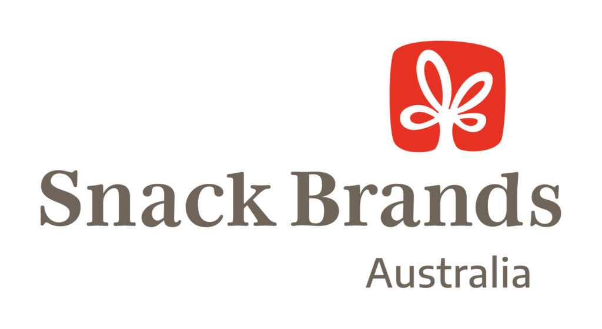
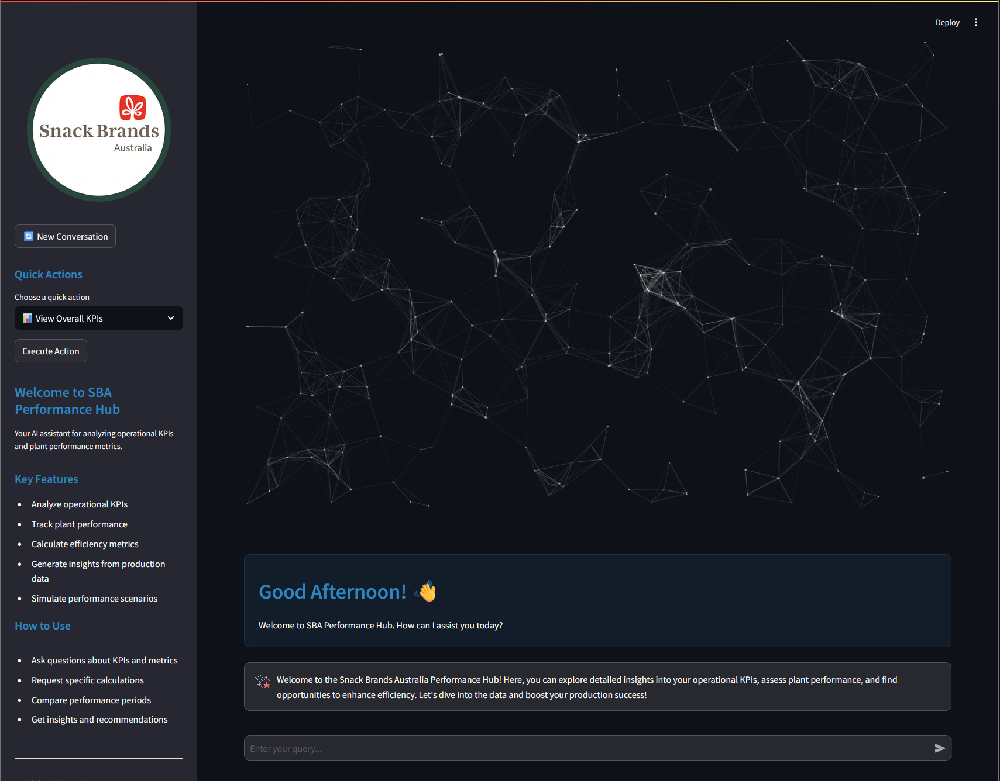

# SBA Performance Hub 🏭

<div align="center">
  
  <br /><br />

  <a href="https://www.python.org/downloads/">
    
  </a>
  <a href="https://streamlit.io">
    
  </a>
  <a href="https://duckdb.org">
    
  </a>
  <a href="LICENSE">
    
  </a>
  <a href="https://github.com/psf/black">
    
  </a>

  <h3><i>AI-powered manufacturing analytics dashboard demo</i></h3>

  <p>
    <a href="#features">Features</a> •
    <a href="#quick-start">Quick Start</a> •
    <a href="#installation">Installation</a> •
    <a href="#usage">Usage</a> •
    <a href="#documentation">Documentation</a>
  </p>
  <hr />
</div>

An AI-powered manufacturing analytics dashboard for Snack Brands Australia, providing real-time insights into operational KPIs and plant performance metrics.

## Features 🚀

- **Interactive Chat Interface**: Natural language queries for manufacturing data analysis
- **Real-time Analytics**: Live monitoring of production metrics and KPIs
- **Manufacturing Metrics**: 
  - Overall Equipment Effectiveness (OEE)
  - Total Effective Equipment Performance (TEEP)
  - Production & Fulfillment Rates
  - Quality & Downtime Analysis
  - Labor Efficiency
- **Data Visualization**: Dynamic charts and metrics visualization
- **Vector Search**: Intelligent querying of manufacturing documentation
- **Responsive Design**: Modern UI with particle.js animations

## Tech Stack 💻

- **Frontend**: Streamlit
- **AI**: OpenAI Assistants API
- **Data Processing**: Python, pandas
- **UI Components**: particles.js
- **Styling**: Custom CSS with glassmorphism effects

## Project Structure 📁

```
├── .streamlit/          # Streamlit configuration
├── assets/             # Static assets and images
├── src/                # Source code
│   ├── app.py          # Main application
│   ├── layout.yaml     # UI layout configuration
│   ├── styles.py       # CSS styling
│   └── service/        # Backend services
│       ├── ai_service.py   # OpenAI integration
│       └── run.py         # Event handling
```

## Prerequisites 📋

- Python 3.8+
- OpenAI API key
- Streamlit
- Required Python packages (see requirements.txt)

## Installation 🛠️

1. Clone the repository:
```bash
git clone https://github.com/yourusername/sba-performance-hub.git
cd sba-performance-hub
```

2. Create and activate virtual environment:
```bash
python -m venv venv
source venv/bin/activate  # On Windows: venv\Scripts\activate
```

3. Install dependencies:
```bash
pip install -r requirements.txt
```

4. Set up environment variables in `.env`:
```
OPENAI_API_KEY=your_api_key
ASSISTANT_ID=your_assistant_id
VECTOR_STORE_ID=your_vector_store_id
```

## Usage 🚀

1. Start the application:
```bash
streamlit run src/app.py
```

2. Open your browser and navigate to `http://localhost:8501`

3. Begin querying manufacturing data through the chat interface

<div align="center">
  
  <br />
  <i>SBA Performance Hub Interface</i>
</div>

## Data Schema 📊

The application uses a comprehensive data model covering:
- Production metrics
- Line performance
- Job status
- Unit counts
- Production stops
- Site information

## Metrics & Calculations 📈

Supports various manufacturing KPIs including:
- OEE Components (Availability, Performance, Quality)
- TEEP Analysis
- Production Fulfillment Rates
- Quality Metrics (Scrap Rate, First Pass Yield)
- Downtime Analysis (MTBF, MTTR)
- Labor Efficiency Metrics

## License 📄

[MIT License](LICENSE)


## Contributing 🤝

1. Fork the repository
2. Create your feature branch (`git checkout -b feature/AmazingFeature`)
3. Commit changes (`git commit -m 'Add AmazingFeature'`)
4. Push to branch (`git push origin feature/AmazingFeature`)
5. Open a Pull Request

## Maintained By 🔧
*SBA Ops Team*