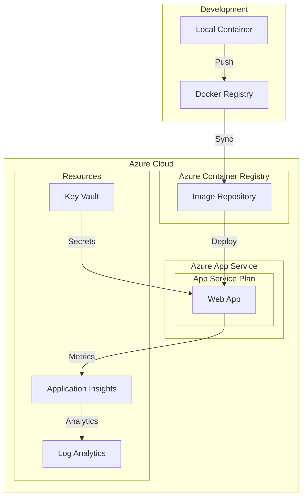
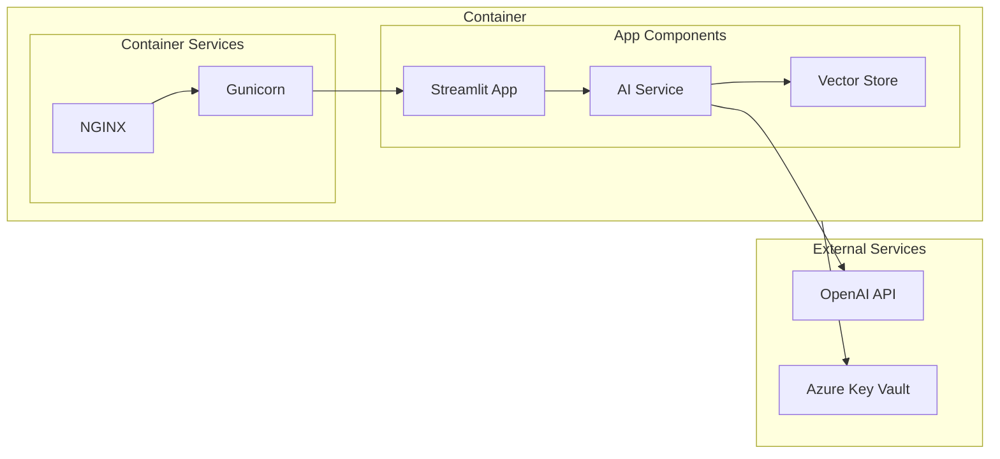
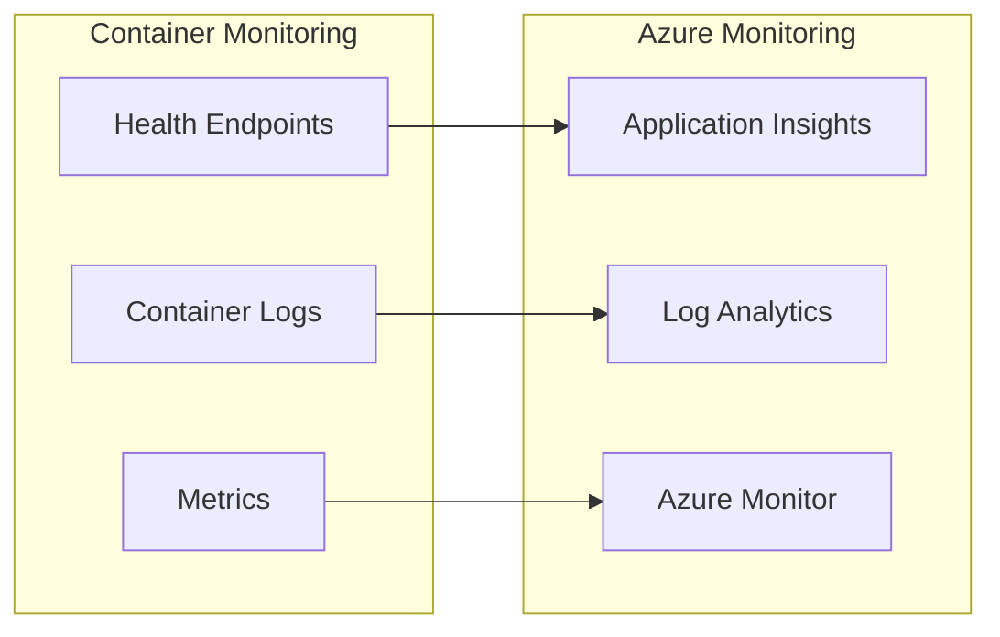
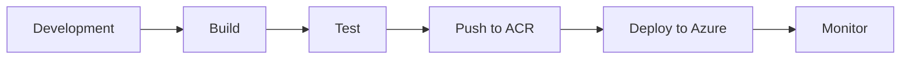

# SBA Performance Hub - Architecture Documentation

## System Overview
The SBA Performance Hub is a containerized manufacturing analytics platform leveraging microservices architecture, deployed on Azure Cloud using container services and app services.

## Deployment Architecture



## Container Architecture



## Component Details

### 1. Containerization Layer
- **Docker Configuration**
  ```yaml
  Components:
    - Base Image: python:3.11.5-slim
    - Exposed Port: 8501
    - Environment: Production
    - Health Checks: Enabled
    - Volume Mounts: Configured
  ```

- **Container Registry**
  ```yaml
  Azure Container Registry:
    - Name: sbaregistry
    - SKU: Standard
    - Replication: Enabled
    - Security: Azure AD Integration
  ```

### 2. Azure App Service Configuration
- **App Service Plan**
  ```yaml
  Plan:
    - Tier: Premium V2
    - Size: P1v2
    - OS: Linux
    - Scaling: Auto-scale enabled
  ```

- **Web App Settings**
  ```yaml
  Configuration:
    - Runtime: Python 3.11
    - Startup Command: Custom
    - HTTPS Only: Enabled
    - Authentication: Azure AD
  ```

### 3. Application Components
- **Frontend Layer**
  - Streamlit interface (app.py)
  - Particle.js system (layout.yaml)
  - Responsive UI components

- **AI Service Layer**
  - OpenAI integration
  - Thread management
  - Response streaming

- **Data Layer**
  - Vector store integration
  - Metrics processing
  - Analytics engine

## Deployment Flow

1. **Local Development**
   ```bash
   # Build Docker image
   docker build -t sba-performance-hub .
   
   # Test locally
   docker-compose up
   ```

2. **Container Registry Push**
   ```bash
   # Tag image
   docker tag sba-performance-hub sbaregistry.azurecr.io/sba-performance-hub:latest
   
   # Push to ACR
   docker push sbaregistry.azurecr.io/sba-performance-hub:latest
   ```

3. **Azure Deployment**
   ```yaml
   Deployment:
     - Source: Azure Container Registry
     - Type: Continuous deployment
     - Branch: main
     - Environment: Production
   ```

## Security Architecture

### 1. Container Security
```yaml
Security:
  Container:
    - Non-root user
    - Read-only filesystem
    - Resource limits
    - Security scanning
```

### 2. Azure Security
```yaml
Azure Security:
  - Managed Identity
  - Key Vault integration
  - Network security groups
  - Azure AD authentication
```

### 3. Application Security
```yaml
App Security:
  - Environment variables
  - Secret management
  - Access controls
  - Session management
```

## Monitoring & Logging

### 1. Container Monitoring


### 2. Azure Monitoring
- Application Insights integration
- Log Analytics workspace
- Azure Monitor metrics
- Custom dashboards

## Scaling Strategy

### 1. Container Scaling
```yaml
Scaling:
  Horizontal:
    - Min instances: 2
    - Max instances: 10
    - Scale rules: CPU/Memory based
```

### 2. Azure Scaling
```yaml
App Service:
  Autoscaling:
    - Scale out conditions
    - Scale in conditions
    - Schedule-based scaling
```

## Performance Optimization

### 1. Container Optimization
- Multi-stage builds
- Layer caching
- Resource allocation
- Performance tuning

### 2. Application Optimization
- Response caching
- Connection pooling
- Memory management
- Query optimization

## Disaster Recovery

### 1. Backup Strategy
```yaml
Backups:
  - Container images
  - Configuration
  - Application data
  - Secrets
```

### 2. Recovery Plan
```yaml
Recovery:
  - Rollback procedures
  - Data recovery
  - Service restoration
  - Failover strategy
```

## Cost Management

### 1. Resource Optimization
```yaml
Optimization:
  - Right-sizing
  - Reserved instances
  - Auto-shutdown
  - Cost monitoring
```

### 2. Monitoring
```yaml
Cost Monitoring:
  - Budget alerts
  - Usage tracking
  - Optimization recommendations
  - Cost analysis
```

## Development Workflow



## Maintenance Procedures

### 1. Updates
```yaml
Maintenance:
  - Image updates
  - Security patches
  - Dependency updates
  - Configuration updates
```

### 2. Monitoring
```yaml
Monitoring:
  - Performance metrics
  - Error tracking
  - Usage analytics
  - Cost analysis
```

