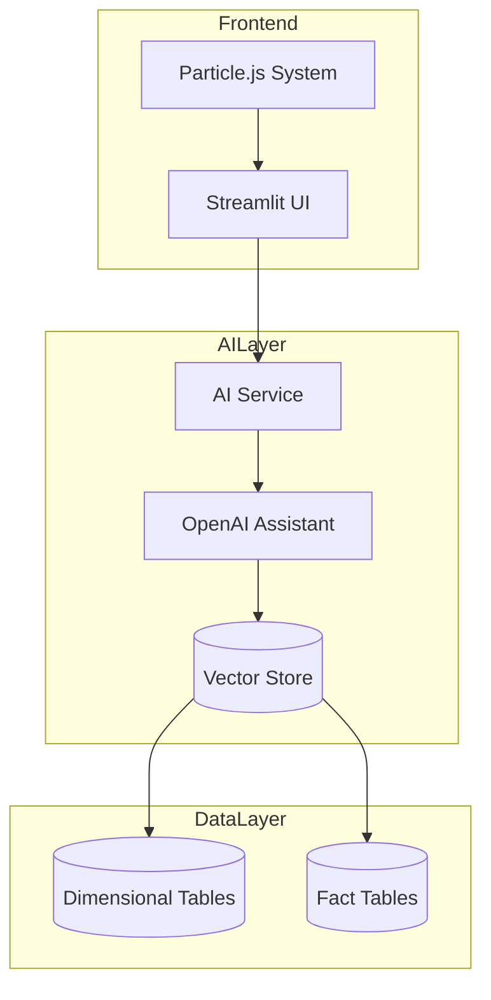
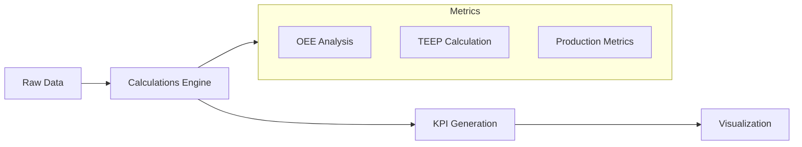

# SBA Performance Hub - Architecture Documentation

## System Overview

The SBA Performance Hub is a manufacturing analytics platform built on a microservices architecture, integrating OpenAI's Assistants API with Streamlit for real-time data analysis.

## Architecture Diagram



## Component Details

### 1. Frontend Layer
- **Streamlit Interface (`app.py`)**
  - Manages user interactions
  - Renders chat interface
  - Handles real-time updates
  - Implements responsive design
  - Uses glassmorphism styling

- **Particle.js System (`layout.yaml`)**
  - Provides interactive background
  - Handles animation effects
  - Manages particle interactions

### 2. AI Layer
- **AI Service (`ai_service.py`)**
  - Manages OpenAI Assistant interactions
  - Handles thread management
  - Processes conversations
  - Manages file uploads

- **Vector Store**
  - Stores preprocessed manufacturing data
  - Enables semantic search
  - Indexes documentation
  - Supports real-time queries

### 3. Data Layer
#### Dimensional Tables
- `DimDate`: Calendar reference
- `DimJobStatus`: Work order statuses
- `DimLine`: Production line details
- `DimLineType`: Line classifications
- `DimSite`: Facility information

#### Fact Tables
- `Production`: Daily production metrics
- `FactMESLinePerformance`: Line efficiency data
- `FactMESProductionStop`: Downtime tracking
- `FactUnitCount`: Production counts

## Data Flow

1. **User Input Flow**
   ```
   User Query → Streamlit UI → AI Service → OpenAI Assistant → Vector Store → Response
   ```

2. **Analytics Flow**
   ```
   Data Layer → Vector Store → AI Service → Metrics Calculation → UI Visualization
   ```

## Security Architecture

- Environment variable management
- API key security
- Data access controls
- Session management

## Integration Points

1. **OpenAI Integration**
   - Assistant API connection
   - Thread management
   - Response streaming

2. **Vector Store Integration**
   - File batch processing
   - Query optimization
   - Data indexing

## Performance Considerations

1. **Response Time Optimization**
   - Streamed responses
   - Cached calculations
   - Optimized queries

2. **Resource Management**
   - Memory efficient processing
   - Connection pooling
   - Thread lifecycle management

## Metrics Processing



## Error Handling

1. **Graceful Degradation**
   - Service fallbacks
   - Error recovery
   - User feedback

2. **Monitoring**
   - Error logging
   - Performance tracking
   - Usage analytics

## Future Considerations

1. **Scalability**
   - Horizontal scaling
   - Load balancing
   - Cache optimization

2. **Feature Expansion**
   - Additional metrics
   - Enhanced visualizations
   - Advanced analytics

## Configuration Management

```yaml
Components:
  Frontend:
    - Streamlit configs
    - UI layouts
    - Style definitions
  Backend:
    - Environment variables
    - API configurations
    - Service settings
```

## Deployment Architecture

1. **Development Environment**
   - Local setup
   - Testing environment
   - Debug configurations

2. **Production Environment**
   - Deployment configs
   - Security settings
   - Performance optimizations
